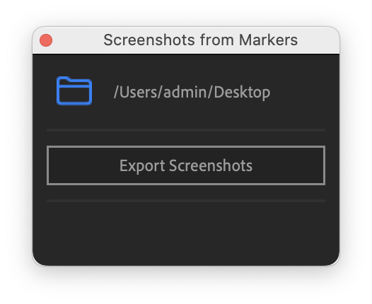

# Markers to Screenshots
Export screenshots from Composition markers in Adobe After Effects

## In action

- Add markers to your composition
- Choose click on the folder icon and choose the export path
- Click `"Export Screenshots"` button

https://user-images.githubusercontent.com/32357978/203274544-5c707997-9fa4-4aac-a328-55752c0c4a57.mov

## Author

Do whatever you want to.
